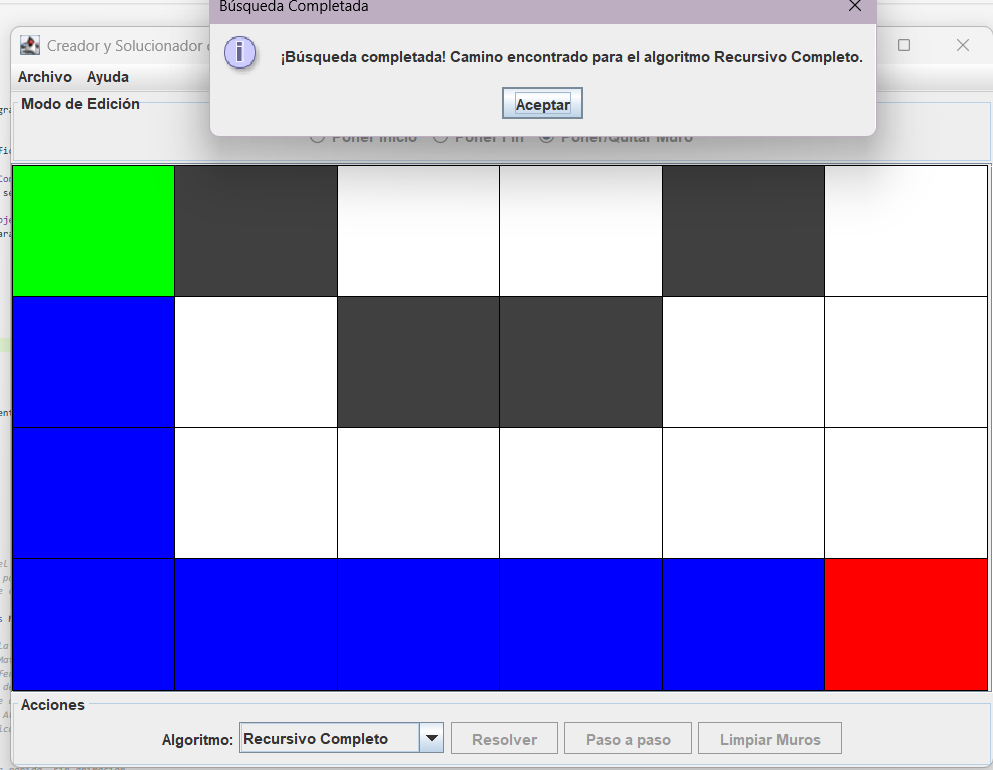

### Asignatura: 
- Estructura de Datos
### Estudiantes: 
- Sebatian Israel Loza Carbo
- Ivanna Alexandra Nievecela Perez
- Luis Felipe Parra Granda
- Wellington Jordy Guzmán Gómez
### Correos:
- sloza@est.ups.edu.ec
- inievecela@est.ups.edu.ec
- lparrag1@est.ups.edu.ec
- wguzmang1@est.ups.edu.ec

# Descripción del problema.

Este proyecto se enfoca en la implementación de diversas estrategias algorítmicas para la resolución de laberintos. Un laberinto se representa como una matriz de celdas, las cuales pueden ser transitables o no transitables (muros). El objetivo principal es encontrar la ruta más corta posible entre un punto de inicio (A) y un punto de destino (B) dentro de este laberinto. La aplicación proporciona un entorno visual interactivo basado en Java Swing para demostrar y comparar el funcionamiento de los algoritmos de búsqueda.

# Propuesta de solución:
La solución se estructura siguiendo un patrón de diseño Modelo-Vista-Controlador (MVC), complementado con el patrón Data Access Object (DAO) para la persistencia de resultados.

- ## Marco teórico

Los algoritmos de búsqueda implementados en este proyecto son esenciales para la navegación y resolución de problemas en grafos y estructuras similares a laberintos.

> Búsqueda en Amplitud (BFS - Breadth-First Search): Este algoritmo explora el laberinto por niveles. Comienza en la celda inicial y explora todas sus celdas vecinas antes de pasar a las siguientes. Garantiza encontrar el camino más corto en términos del número de celdas, ya que procesa el grafo capa por capa. La implementación de MazeSolverBFS utiliza una cola (java.util.Queue) para gestionar las celdas a visitar, lo que es característico de BFS.

> Búsqueda en Profundidad (DFS - Depth-First Search): Este algoritmo explora tan profundo como sea posible a lo largo de cada rama antes de retroceder. En este proyecto, MazeSolverDFS implementa esta lógica de forma recursiva, utilizando una pila (java.util.Stack) para simular el comportamiento de la recursión en su versión paso a paso. La ruta se construye hacia atrás una vez que se alcanza el destino.

> Recursión: Es una técnica de programación donde una función se llama a sí misma para resolver un problema, dividiéndolo en subproblemas más pequeños de la misma naturaleza. En el contexto de este proyecto, la recursión se utiliza en la implementación base de los algoritmos de búsqueda para explorar caminos en el laberinto. Por ejemplo, MazeSolverRecursivo explora en 2 direcciones (derecha y abajo), mientras que MazeSolverRecursivoCompleto explora en 4 direcciones (abajo, derecha, arriba, izquierda) 

>Backtracking: Es una técnica algorítmica que se utiliza para encontrar todas las (o algunas) soluciones a problemas computacionales, especialmente aquellos que tienen múltiples soluciones y se pueden construir de forma incremental. Cuando se encuentra un "callejón sin salida" (una opción que no conduce a una solución), el algoritmo "retrocede" (backtracks) a un punto anterior y explora otra rama. La clase MazeSolverRecursivoCompletoBT implementa un DFS con backtracking explícito, eliminando celdas del camino cuando una rama no lleva a la solución.

- ## Tecnologías utilizadas.

   -  **Java Development Kit (JDK):** 
Lenguaje de programación principal.

   - **Java Swing:** 
Para la construcción de la interfaz gráfica de usuario (GUI).

    - **JFreeChart:**
Biblioteca para la generación de gráficos, utilizada para visualizar y comparar los tiempos de ejecución de los algoritmos.

    - **Patrón de Diseño MVC (Modelo-Vista-Controlador):**
Organiza la lógica de la aplicación, separando la representación de los datos (Model), la interfaz de usuario (View) y la lógica de negocio (Controller).

    - **Patrón de Diseño DAO (Data Access Object):**
Proporciona una interfaz abstracta para acceder a los datos, desacoplando la lógica de negocio de la capa de persistencia (en este caso, un archivo CSV).


- ## Diagrama UML


- ## Capturas
A continuación, se presentan dos ejemplos de la interfaz de usuario, mostrando la resolución de laberintos con 
diferentes algoritmos.

- **Ejemplo 1: Algoritmo Recursivo**


Esta imagen muestra otro laberinto, aparentemente de 3x5, siendo resuelto por el algoritmo "Recursivo". De manera similar al ejemplo anterior, el punto de inicio es verde y el destino es rojo. Se pueden ver muros en gris oscuro. Después de ejecutar el algoritmo, la interfaz muestra el camino descubierto en color azul. La confirmación "Búsqueda completada! Camino encontrado para el algoritmo Recursivo." indica que la búsqueda ha sido exitosa para este algoritmo específico. Es notable cómo el camino azul se dirige principalmente hacia abajo y a la derecha, lo cual es consistente con la descripción del algoritmo MazeSolverRecursivo que prioriza esas direcciones.

- **Ejemplo 2: Algoritmo Recursivo Completo**



En esta captura, se observa un laberinto de dimensiones 4x6. El punto de inicio está marcado en verde en la esquina superior izquierda, y el destino en rojo en la esquina inferior derecha. Las celdas de color gris oscuro representan muros, mientras que las blancas son caminos transitables. Se ha seleccionado el algoritmo "Recursivo Completo" para la resolución. Una vez que el algoritmo ha finalizado, la ruta encontrada se visualiza en color azul. La ventana emergente "Búsqueda Completada" confirma que el algoritmo "Recursivo Completo" ha encontrado un camino hacia el destino.


- ## Codigo de ejemplo

A continuación, se presenta un fragmento de código y su explicación para el algoritmo Búsqueda en Amplitud (BFS) (MazeSolverBFS.java), uno de los algoritmos implementados para la resolución de laberintos.

```java
package solver.solverImpl;

import java.util.*;
import models.Cell;
import models.CellState;
import solver.MazeSolver;

/**
 * Resuelve el laberinto utilizando el algoritmo de Búsqueda en Amplitud (BFS).
 * Este enfoque explora el laberinto por niveles, garantizando encontrar el camino
 * más corto en términos de número de celdas.
 */
public class MazeSolverBFS implements MazeSolver {

    private Queue<Cell> queue; // Cola para gestionar las celdas a visitar (característico de BFS)
    private boolean[][] visited; // Matriz para registrar las celdas ya visitadas
    private Cell[][] mazeGrid; // Referencia a la cuadrícula del laberinto
    private Cell startCell; // Celda de inicio
    private Cell endCell; // Celda de destino
    private List<Cell> finalPath; // Almacena el camino final encontrado
    private boolean finished; // Indica si la búsqueda ha terminado

    /**
     * Resuelve el laberinto de forma rápida, sin animación.
     * @param mazeGrid La matriz 2D de celdas que representa el laberinto.
     * @param start La celda de inicio.
     * @param end La celda de destino.
     * @return Una lista de celdas que forman el camino más corto.
     */
    @Override
    public List<Cell> solve(Cell[][] mazeGrid, Cell start, Cell end) {
        Queue<Cell> localQueue = new LinkedList<>(); // Cola local para la ejecución rápida
        boolean[][] localVisited = new boolean[mazeGrid.length][mazeGrid[0].length]; // Matriz de visitados local

        start.setParent(null); // La celda de inicio no tiene padre
        localQueue.add(start); // Añade la celda de inicio a la cola
        localVisited[start.getRow()][start.getCol()] = true; // Marca la celda de inicio como visitada

        while (!localQueue.isEmpty()) { // Mientras la cola no esté vacía
            Cell current = localQueue.poll(); // Saca la primera celda de la cola

            if (current.equals(end)) { // Si la celda actual es la celda de destino
                return reconstructPath(current); // Reconstruye y retorna el camino
            }
            
            // Direcciones para explorar vecinos: Abajo, Arriba, Derecha, Izquierda
            int[] dr = {1, -1, 0, 0}; 
            int[] dc = {0, 0, 1, -1};

            for (int i = 0; i < 4; i++) { // Itera sobre las 4 direcciones
                int nRow = current.getRow() + dr[i]; // Calcula la fila del vecino
                int nCol = current.getCol() + dc[i]; // Calcula la columna del vecino

                // Verifica si el vecino está dentro de los límites, no ha sido visitado y no es un muro
                if (nRow >= 0 && nCol >= 0 && nRow < mazeGrid.length && nCol < mazeGrid[0].length &&
                        !localVisited[nRow][nCol] && mazeGrid[nRow][nCol].getState() != CellState.WALL) {
                    
                    localVisited[nRow][nCol] = true; // Marca el vecino como visitado
                    Cell neighbor = mazeGrid[nRow][nCol];
                    neighbor.setParent(current); // Establece la celda actual como padre del vecino
                    localQueue.add(neighbor); // Añade el vecino a la cola para su futura exploración
                }
            }
        }
        return Collections.emptyList(); // Retorna una lista vacía si no se encontró un camino
    }

    /**
     * Inicializa el algoritmo para una ejecución paso a paso (manual).
     * Prepara el estado interno del solucionador para avanzar celda por celda.
     */
    @Override
    public void initializeStepByStep(Cell[][] maze, Cell start, Cell end) {
        this.mazeGrid = maze;
        this.startCell = start;
        this.endCell = end;
        this.queue = new LinkedList<>(); // Inicializa la cola
        this.visited = new boolean[maze.length][maze[0].length]; // Inicializa la matriz de visitados
        this.finalPath = Collections.emptyList();
        this.finished = false;

        // Reinicia los padres de todas las celdas para una nueva búsqueda.
        for (int r = 0; r < maze.length; r++) {
            for (int c = 0; c < maze[0].length; c++) {
                maze[r][c].setParent(null);
            }
        }

        startCell.setParent(null); // La celda inicial no tiene padre.
        queue.add(startCell); // Añade la celda de inicio a la cola.
        visited[startCell.getRow()][startCell.getCol()] = true; // Marca la celda de inicio como visitada.
    }

    /**
     * Ejecuta un solo paso del algoritmo BFS.
     * @return La celda visitada en este paso, o null si la búsqueda ha terminado o no hay más pasos.
     */
    @Override
    public Cell doStep() {
        if (finished || queue.isEmpty()) { // Si ya terminó o la cola está vacía, no hay más pasos.
            finished = true;
            return null;
        }

        Cell current = queue.poll(); // Saca la siguiente celda de la cola.

        if (current.equals(endCell)) { // Si se encontró el destino.
            finalPath = reconstructPath(current); // Reconstruye el camino final.
            finished = true;
            return current; // Retorna la celda final.
        }
        
        // Explora los vecinos de la celda actual y los añade a la cola si son válidos.
        int[] dr = {1, -1, 0, 0}; // Abajo, Arriba, Derecha, Izquierda
        int[] dc = {0, 0, 1, -1};

        for (int i = 0; i < 4; i++) {
            int nRow = current.getRow() + dr[i];
            int nCol = current.getCol() + dc[i];

            if (nRow >= 0 && nCol >= 0 && nRow < mazeGrid.length && nCol < mazeGrid[0].length &&
                    !visited[nRow][nCol] && mazeGrid[nRow][nCol].getState() != CellState.WALL) {
                
                visited[nRow][nCol] = true; // Marca como visitado.
                Cell neighbor = mazeGrid[nRow][nCol];
                neighbor.setParent(current); // Establece el padre.
                queue.add(neighbor); // Añade a la cola.
            }
        }
        return current; // Retorna la celda que acaba de ser procesada.
    }

    /**
     * Verifica si la búsqueda paso a paso ha terminado.
     */
    @Override
    public boolean isStepByStepFinished() {
        return finished;
    }

    /**
     * Devuelve el camino final después de la búsqueda paso a paso.
     */
    @Override
    public List<Cell> getFinalPath() {
        return finalPath;
    }

    /**
     * Reconstruye el camino desde la celda final hasta la inicial, siguiendo los "padres".
     * @param cell La celda final encontrada por el algoritmo.
     * @return La lista de celdas que componen el camino, en orden de inicio a fin.
     */
    private List<Cell> reconstructPath(Cell cell) {
        List<Cell> path = new ArrayList<>();
        Cell current = cell;
        while (current != null) {
            path.add(current);
            current = current.getParent(); // Se mueve hacia atrás, al padre de la celda actual.
        }
        Collections.reverse(path); // Se invierte la lista para tener el camino en el orden correcto.
        return path;
    }
}
```
### Explicación:
- **solve(Cell[][] mazeGrid, Cell start, Cell end):** Este método implementa la lógica principal del BFS para encontrar la ruta más corta sin visualización paso a paso. Utiliza una LinkedList como cola para gestionar las celdas a visitar. Marca las celdas visitadas en una matriz localVisited y establece la propiedad parent de cada celda para permitir la reconstrucción del camino una vez que se alcanza la celda end.

- **initializeStepByStep(Cell[][] maze, Cell start, Cell end):** Este método prepara el estado del solucionador para el modo de ejecución paso a paso. Inicializa la cola, la matriz visited y reinicia el parent de todas las celdas para asegurar un estado limpio en cada nueva búsqueda. La celda de inicio se añade a la cola y se marca como visitada.

- **doStep():** Este es el corazón de la ejecución paso a paso. En cada llamada, saca la siguiente celda de la cola. Si la celda es el destino, se reconstruye el camino final. De lo contrario, explora sus vecinos (en las 4 direcciones: Abajo, Arriba, Derecha, Izquierda), los marca como visitados (si no lo estaban y no son muros) y los añade a la cola. La celda procesada en este paso se retorna para que la interfaz pueda actualizar su visualización.

- **reconstructPath(Cell cell):** Un método auxiliar crucial que, dado el endCell (o cualquier celda en el camino de la solución), retrocede a través de las referencias parent de cada celda para construir la lista completa del camino desde el inicio hasta el final. La lista se invierte al final para obtener el orden correcto.

# Conclusiones.

- **Sebastian Loza:** "Tras la implementación y comparación de los distintos algoritmos de búsqueda, se concluye que el algoritmo BFS (Búsqueda en Amplitud) es el más óptimo para encontrar la ruta más corta en laberintos no ponderados. Su naturaleza de explorar por niveles garantiza que la primera vez que se alcanza el destino, se hace a través del camino con menor número de celdas. Aunque puede consumir más memoria en laberintos grandes debido a la cola, su completitud y optimalidad en términos de longitud del camino lo hacen ideal para este tipo de problema."

- **Ivanna Nievecela:** "El algoritmo DFS (Búsqueda en Profundidad) y sus variantes recursivas demostraron ser eficientes en términos de uso de memoria, ya que su pila de llamadas solo almacena las celdas de la ruta actual. Sin embargo, su principal desventaja es que no garantiza encontrar el camino más corto, pudiendo explorar ramas muy profundas antes de encontrar una solución, o incluso la solución óptima. Esto lo hace menos adecuado para casos donde la longitud del camino es una métrica crítica, pero útil en escenarios donde solo se necesita 'encontrar un camino' rápidamente."

- **Felipe Parra:** "La aplicación del patrón Modelo-Vista-Controlador (MVC) y Data Access Object (DAO) fue fundamental para mantener una estructura de código limpia, modular y fácil de mantener. La separación de responsabilidades entre la lógica del laberinto (Modelo), la interfaz de usuario (Vista) y la interacción (Controlador) facilitó el desarrollo, la depuración y la futura expansión del proyecto. El DAO, en particular, abstrae la persistencia de datos, permitiendo cambiar fácilmente el método de almacenamiento (ej., de CSV a base de datos) sin afectar otras partes del sistema."

- **Wellinton Guzmán:** "La capacidad de visualizar el funcionamiento de los algoritmos paso a paso resultó ser una herramienta pedagógica invaluable. Permitió comprender intuitivamente cómo cada algoritmo explora el laberinto, cómo se visitan las celdas y cómo se construye el camino. Esta interacción visual, junto con el registro de resultados y la graficación de tiempos de ejecución, proporciona una plataforma robusta no solo para resolver laberintos, sino también para analizar y comparar empíricamente el rendimiento de diferentes estrategias algorítmicas."

# Recomendaciones y aplicaciones futuras.
- **Algoritmos Avanzados:** Se podría implementar algoritmos de búsqueda más avanzados como A* o Dijkstra, que utilizan heurísticas para encontrar caminos óptimos en laberintos con costos de movimiento variables o para encontrar el camino más corto en laberintos ponderados.

- **Generación de Laberintos:** Integrar algoritmos para la generación dinámica de laberintos (ej., con el algoritmo de Prim o Kruskal) para ofrecer una experiencia de usuario más completa.

- **Optimización de Rendimiento:** En futuros desarrollos, se podría incorporar memoización o tabulación en algunos algoritmos recursivos para reducir la complejidad temporal, especialmente en laberintos de gran tamaño.

- **Interfaces Más Interactivas:** Mejorar la visualización con animaciones más fluidas, opciones de pausar/reanudar más robustas, y permitir la edición del laberinto en tiempo real durante la simulación (si es compatible con el algoritmo).

- **Análisis de Complejidad:** Incluir un análisis y visualización de la complejidad temporal y espacial de cada algoritmo para laberintos de diferentes tamaños, lo que proporcionaría una comparación más profunda.

- **Persistencia Mejorada:** Considerar opciones de persistencia más robustas que un CSV, como una base de datos SQLite, para almacenar y consultar resultados de manera más eficiente y con mayor flexibilidad.